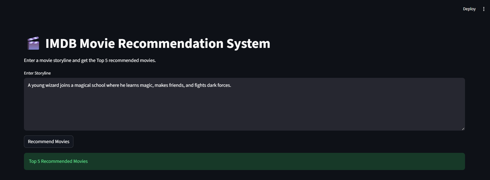
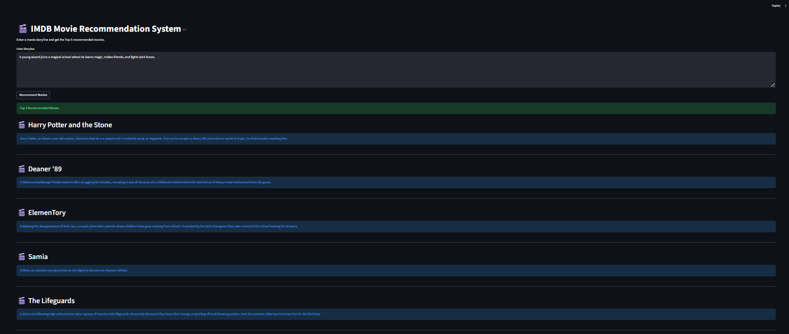
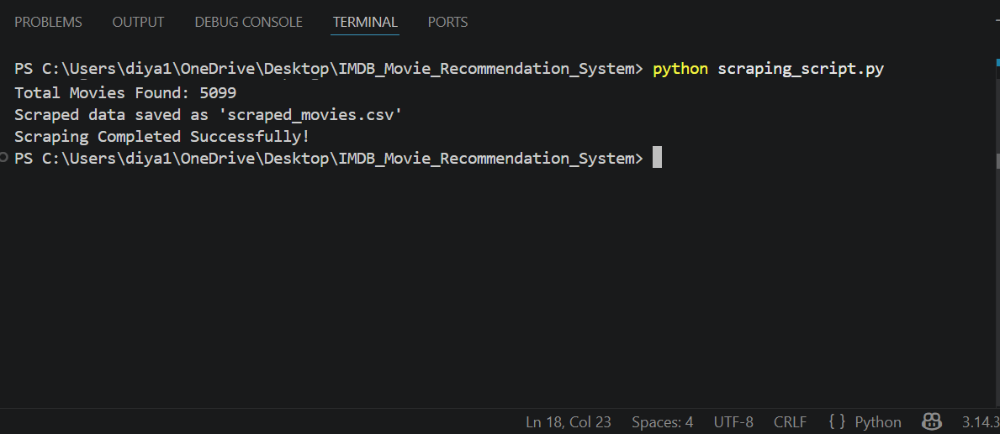
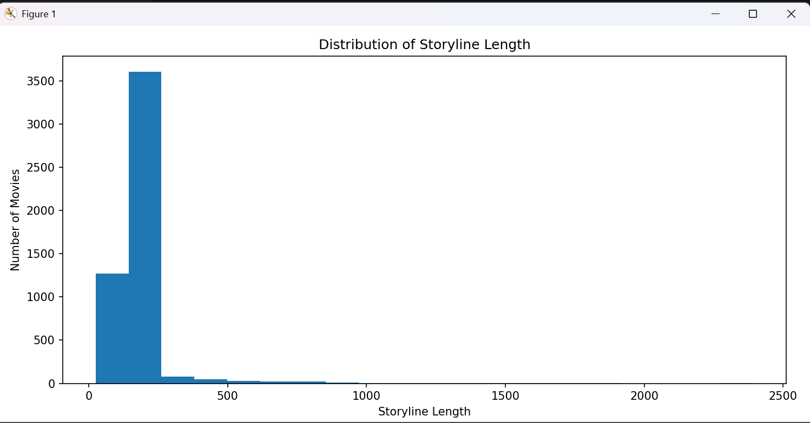

# 🎬 IMDB Movie Recommendation System Using Storylines

A Content-Based Movie Recommendation System built using Natural Language Processing (NLP), TF-IDF Vectorization, Cosine Similarity, Selenium, and Streamlit.

---

# 📌 Project Overview

This project recommends movies based on storyline similarity. The recommendation engine analyzes movie storylines using Natural Language Processing techniques and suggests the top 5 most relevant movies for a given storyline.

The application is built with Streamlit and provides an interactive user interface for generating recommendations.

---

# 🎯 Problem Statement

With thousands of movies available online, users often struggle to find movies matching their interests.

The objective of this project is to:

- Collect movie data from IMDb.
- Store movie names and storylines.
- Process textual data using NLP techniques.
- Generate recommendations based on storyline similarity.
- Display recommendations through a Streamlit application.

---

# 🛠️ Technologies Used

- Python
- Pandas
- NumPy
- Scikit-Learn
- Selenium
- Streamlit
- Matplotlib
- Natural Language Processing (NLP)

---

# 📂 Project Structure

```text
IMDB_MOVIE_RECOMMENDATION_SYSTEM/
│
├── app/
│   └── app.py
│
├── data/
│   ├── imdb_movies_2024.csv
│   └── scraped_movies.csv
│
├── src/
│   ├── recommendation_engine.py
│   ├── scraping_script.py
│   └── visualization.py
│
├── notebooks/
│   └── IMDB_Movie_Recommendation.ipynb
│
├── reports/
│   └── Project_Report.docx
│
├── images/
│   ├── home_page.png
│   ├── recommendation_output.png
│   ├── selenium_scraper.png
│   └── storyline_distribution.png
│
├── README.md
├── requirements.txt
└── .gitignore
```

---

# 📊 Dataset Information

Dataset Columns:

| Column Name | Description |
|------------|-------------|
| Movie Name | Movie Title |
| Storyline | Original Movie Storyline |
| Cleaned_Storyline | Processed Storyline |

Dataset Size:

- Total Movies: 5099
- Features: 3

---

# 🔄 Workflow

### Step 1: Data Collection

Movie information is collected and stored in CSV format.

### Step 2: Data Preprocessing

The storyline text is cleaned using NLP techniques:

- Lowercase conversion
- Punctuation removal
- Stopword removal
- Tokenization

### Step 3: Feature Extraction

TF-IDF Vectorization converts textual storylines into numerical vectors.

### Step 4: Similarity Calculation

Cosine Similarity is used to measure similarity between movie storylines.

### Step 5: Recommendation Generation

The system returns the Top 5 most similar movies.

### Step 6: Streamlit Deployment

The recommendation engine is integrated into a Streamlit web application.

---

# 🚀 How to Run the Project

## 1. Clone Repository

```bash
git clone https://github.com/Tania94-hub/IMDB-Movie-Recommendation-System.git
```

## 2. Navigate to Project Folder

```bash
cd IMDB_MOVIE_RECOMMENDATION_SYSTEM
```

## 3. Install Dependencies

```bash
pip install -r requirements.txt
```

## 4. Run Streamlit Application

```bash
python -m streamlit run app/app.py
```

---

# 📸 Project Screenshots

## Home Page



---

## Recommendation Output



---

## Selenium Scraping



---

## Storyline Distribution Visualization



---

# 📈 Recommendation Technique

### TF-IDF Vectorization

TF-IDF assigns importance scores to words based on frequency and uniqueness.

### Cosine Similarity

Cosine Similarity measures the similarity between movie storylines and identifies the most relevant recommendations.

---

# 🎯 Results

The recommendation system successfully:

- Processes movie storylines.
- Generates relevant movie recommendations.
- Returns Top 5 similar movies.
- Provides recommendations through an interactive Streamlit interface.

---

# 🔮 Future Enhancements

- Genre-Based Recommendations
- Hybrid Recommendation Systems
- User Ratings Integration
- Deep Learning Recommendation Models
- Cloud Deployment
- Real-Time IMDb Scraping

---

# 📚 References

- IMDb
- Python Documentation
- Scikit-Learn Documentation
- Streamlit Documentation
- Selenium Documentation
- Pandas Documentation

---

# 👩‍💻 Author

**Tania Banerjee**

GUVI – HCL Project

IMDB Movie Recommendation System Using Storylines
